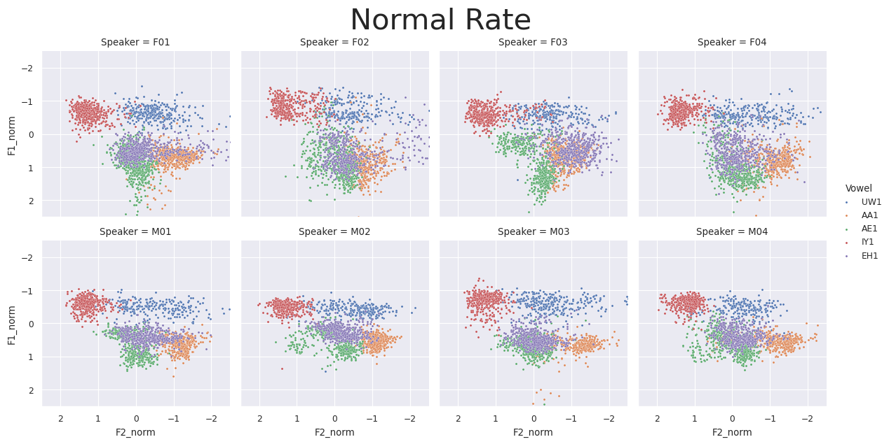
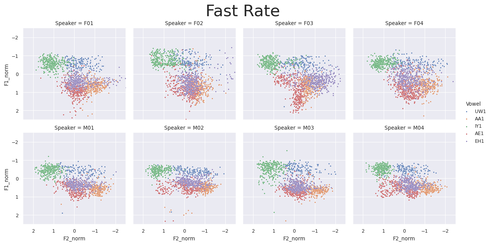
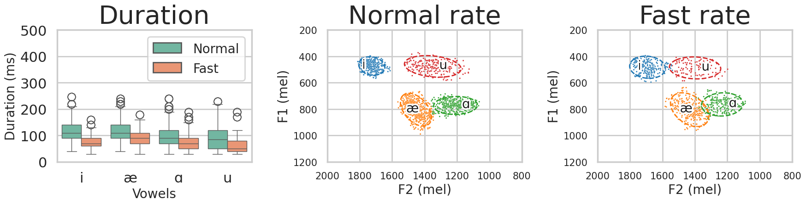
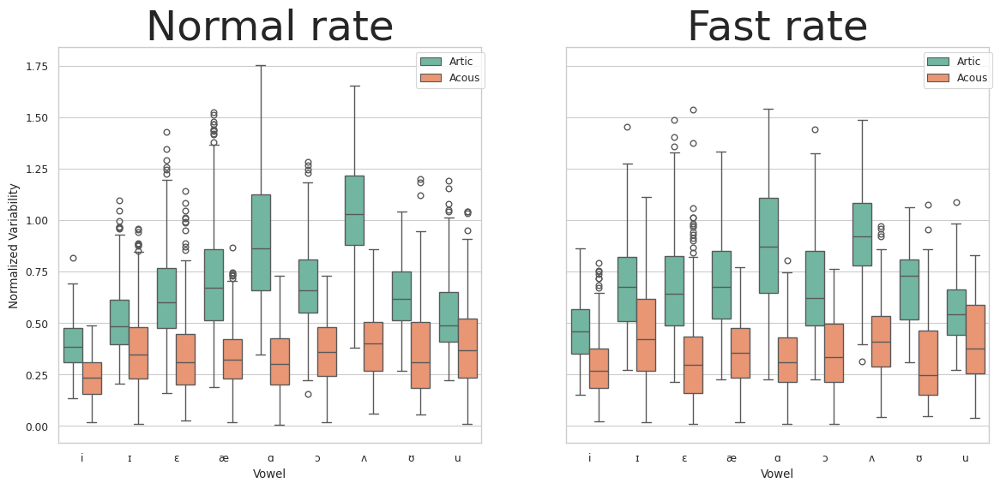

# AR1: IEEE Rate Comparison

last updated: 2025-01-23

***

## 1. Description

Database of speech production recorded at two speech rates (ie., "fast" vs. "normal")

|   |   |   |
| - | - | - |
|   |   |   |
|   |   |   |
|   |   |   |

## 2. Data types

1. Articulatory data (EMA; electromagnetic articolography)
2. Acoustic data (simultaneous recording)

## 3. Data specifications

### (1) Articulatory data

* EMA data
* Head movement is corrected and aligned to occlusal plane with origin at UI ref (upper incisor).
* Sensors (See [#figure-1](ieee_rate_comparison.md#figure-1 "mention"))
  * TR: tongue rear (dorsum)
  * TB: tongue blade
  * TT: tongue tip (\~ 1cm back from apex)
  * UL: upper lip (vermillion border)
  * LL: lower lip
  * ML: mouth left (corner)
  * JAW: jaw (lower medial incisors)
  * JAWL: jaw left (canine)

#### Figure 1. Articulatory data sensor locations

 

### (2) Acoustic data

#### Figure 2. Normal vs. fast rate.

Normalized vowel formant frequencies by 8 speakers (F01-04, M01-M04) and 5 vowels (IY1, EH1, AE1, AA1, UW1); Normal rate (top) and fast rate (bottom).

## 4. Exploratory Data Analysis

For the exploratory data analysis, outliers were removed first (e.g., too short tokens and values above or below 2 standard deviations). Nine vowels were selected for the visualization. 10 equidistant time points were also extracted given acoustic vowel intervals (e.g., 0%, 12.5%, 25% to 100%). Vowel data were also normalized using the Z-scoring method, but median was used instead of mean for the vowel acoustics normalization.

#### Figure 3. Effect of outlier removal

<figure><figcaption>
Before removing outliers
</figcaption></figure>

<figure><figcaption>
After removing outliers
</figcaption></figure>

### (1) Descriptive statistics

#### Descriptive statistics

<table><thead><tr><th width="87"></th><th width="87">Token</th><th width="87">Block</th><th width="87">Rep</th><th width="87">Duration</th><th width="87">TimeAt</th><th width="87">TimeSec</th><th width="87">f0</th><th width="87">F1</th><th width="87">F2</th><th width="87">F3</th><th width="87">TRx</th><th width="87">TRz</th><th width="87">TBx</th><th width="87">TBz</th><th width="87">TTx</th><th width="87">TTz</th><th width="87">JAWx</th><th width="87">JAWz</th><th width="87">ULx</th><th width="87">ULz</th><th width="87">LLx</th><th width="87">LLz</th><th width="87">F1_mel</th><th width="87">F2_mel</th><th width="87">AcousVar</th><th width="87">ArticVar</th><th width="87">RescaleFactorAcous</th><th width="87">RescaleFactorArtic</th><th width="87">F1_grandmean</th><th width="87">F2_grandmean</th><th width="87">F1_norm</th><th width="87">F2_norm</th><th width="87">TRx_norm</th><th width="87">TRz_norm</th><th width="87">TBx_norm</th><th width="87">TBz_norm</th><th width="87">TTx_norm</th><th width="87">TTz_norm</th><th width="87">JAWx_norm</th><th width="87">JAWz_norm</th><th width="87">ULx_norm</th><th width="87">ULz_norm</th><th width="87">LLx_norm</th><th width="87">LLz_norm</th></tr></thead><tbody><tr><td>count</td><td>306081</td><td>306081</td><td>306081</td><td>306081</td><td>306081</td><td>306081</td><td>306081</td><td>306081</td><td>306081</td><td>306081</td><td>306081</td><td>306081</td><td>306081</td><td>306081</td><td>306081</td><td>306081</td><td>306081</td><td>306081</td><td>306081</td><td>306081</td><td>306081</td><td>306081</td><td>306081</td><td>306081</td><td>306081</td><td>306081</td><td>306081</td><td>306081</td><td>306081</td><td>306081</td><td>306081</td><td>306081</td><td>306081</td><td>306081</td><td>306081</td><td>306081</td><td>306081</td><td>306081</td><td>306081</td><td>306081</td><td>306081</td><td>306081</td><td>306081</td><td>306081</td></tr><tr><td>mean</td><td>25817.4196</td><td>5.99382516</td><td>1.11608692</td><td>0.0931734</td><td>0.5</td><td>1.06901132</td><td>180.416863</td><td>564.07901</td><td>1704.40149</td><td>2697.64193</td><td>-48.287724</td><td>-3.8922096</td><td>-32.427336</td><td>-4.2093102</td><td>-17.294099</td><td>-11.133523</td><td>-2.5009652</td><td>-22.989009</td><td>10.0820666</td><td>2.69380421</td><td>7.98798615</td><td>-27.667904</td><td>657.511623</td><td>1370.48874</td><td>0.44638147</td><td>0.74852451</td><td>231.341715</td><td>231.341715</td><td>624.628297</td><td>1409.76836</td><td>0.14272918</td><td>-0.1696875</td><td>-0.0399134</td><td>-0.1148263</td><td>-0.0606016</td><td>-0.1105816</td><td>-0.0451106</td><td>-0.0213222</td><td>-0.0116998</td><td>-0.0239626</td><td>-0.005029</td><td>-0.0039261</td><td>-0.0150792</td><td>-0.0193886</td></tr><tr><td>std</td><td>14952.1351</td><td>3.54414617</td><td>0.32032964</td><td>0.0481705</td><td>0.32274914</td><td>0.55394107</td><td>68.2895563</td><td>159.323441</td><td>455.928176</td><td>473.773303</td><td>6.5541042</td><td>5.33069493</td><td>5.92266187</td><td>5.68090117</td><td>4.84232446</td><td>4.82989723</td><td>2.89743449</td><td>3.6738213</td><td>2.11696562</td><td>3.0568462</td><td>3.82983853</td><td>4.14313686</td><td>137.729863</td><td>213.758732</td><td>0.30883605</td><td>0.30338702</td><td>12.8260928</td><td>12.8260928</td><td>38.3280396</td><td>46.0087092</td><td>0.57119487</td><td>0.91208976</td><td>0.30928616</td><td>0.37146982</td><td>0.33837075</td><td>0.42168698</td><td>0.37708844</td><td>0.3760615</td><td>0.11909212</td><td>0.25470722</td><td>0.11812771</td><td>0.11650088</td><td>0.16082425</td><td>0.32091437</td></tr><tr><td>min</td><td>0</td><td>1</td><td>1</td><td>0.03</td><td>0</td><td>0.0923</td><td>74.6</td><td>182.8</td><td>535.8</td><td>1281</td><td>-72.7295</td><td>-24.8401</td><td>-56.3686</td><td>-28.7271</td><td>-38.3853</td><td>-35.1347</td><td>-13.522</td><td>-44.9243</td><td>3.5146</td><td>-8.8569</td><td>-7.6945</td><td>-52.5675</td><td>261.483318</td><td>640.576141</td><td>0.00032473</td><td>0.08294064</td><td>215.016204</td><td>215.016204</td><td>562.318231</td><td>1327.72622</td><td>-1.5883209</td><td>-3.3865053</td><td>-1.5912007</td><td>-1.9920807</td><td>-1.612432</td><td>-1.9953885</td><td>-2.0332201</td><td>-1.6261356</td><td>-0.6710546</td><td>-1.743179</td><td>-0.6394491</td><td>-0.6578502</td><td>-1.103905</td><td>-1.682001</td></tr><tr><td>25%</td><td>13062</td><td>3</td><td>1</td><td>0.0598</td><td>0.25</td><td>0.6066</td><td>125.3</td><td>445.8</td><td>1366.5</td><td>2400.9</td><td>-52.5944</td><td>-7.8013</td><td>-36.3448</td><td>-8.1937</td><td>-19.8337</td><td>-14.1395</td><td>-4.2382</td><td>-24.9515</td><td>8.4802</td><td>0.3312</td><td>5.2336</td><td>-30.0032</td><td>555.357969</td><td>1220.00647</td><td>0.23413933</td><td>0.52216922</td><td>220.314511</td><td>220.314511</td><td>594.930035</td><td>1374.91138</td><td>-0.3006424</td><td>-0.8038874</td><td>-0.2191957</td><td>-0.3796883</td><td>-0.2477465</td><td>-0.4036565</td><td>-0.2355494</td><td>-0.266108</td><td>-0.0842356</td><td>-0.1636168</td><td>-0.0873602</td><td>-0.0667891</td><td>-0.1055632</td><td>-0.204694</td></tr><tr><td>50%</td><td>25766</td><td>6</td><td>1</td><td>0.0798</td><td>0.5</td><td>1.0069</td><td>174.8</td><td>555.9</td><td>1660.7</td><td>2721.7</td><td>-47.9779</td><td>-3.7379</td><td>-32.1332</td><td>-3.8586</td><td>-16.7011</td><td>-10.7491</td><td>-2.2016</td><td>-22.5514</td><td>10.2935</td><td>2.5067</td><td>7.7866</td><td>-27.2855</td><td>658.758968</td><td>1370.01146</td><td>0.38099573</td><td>0.70059088</td><td>221.417494</td><td>221.417494</td><td>620.042527</td><td>1428.12894</td><td>0.17780355</td><td>-0.2090085</td><td>-0.0085042</td><td>-0.1385197</td><td>-0.020835</td><td>-0.0784266</td><td>0.0130775</td><td>0.01288615</td><td>-0.0044277</td><td>0.01920254</td><td>-0.0155053</td><td>0.00866523</td><td>-0.002373</td><td>-0.0015482</td></tr><tr><td>75%</td><td>38883</td><td>9</td><td>1</td><td>0.1197</td><td>0.75</td><td>1.4509</td><td>220.1</td><td>653.1</td><td>1988.3</td><td>3035.7</td><td>-43.5963</td><td>-0.2512</td><td>-28.1106</td><td>0.2618</td><td>-13.9211</td><td>-7.7019</td><td>-0.4374</td><td>-20.5077</td><td>11.612</td><td>5.3815</td><td>11.1203</td><td>-24.9241</td><td>742.771661</td><td>1516.4653</td><td>0.58367177</td><td>0.92914461</td><td>242.572743</td><td>242.572743</td><td>656.458108</td><td>1440.02658</td><td>0.53929436</td><td>0.4160294</td><td>0.16399707</td><td>0.16722677</td><td>0.17354431</td><td>0.22479677</td><td>0.21764991</td><td>0.25085575</td><td>0.0683555</td><td>0.16052284</td><td>0.06553869</td><td>0.07347171</td><td>0.09107466</td><td>0.19192306</td></tr><tr><td>max</td><td>51933</td><td>12</td><td>2</td><td>0.4191</td><td>1</td><td>3.3828</td><td>499.9</td><td>1978.9</td><td>3242.2</td><td>4180.2</td><td>-25.8357</td><td>9.5182</td><td>-17.0808</td><td>9.9174</td><td>-3.5354</td><td>6.6197</td><td>5.2834</td><td>-14.6968</td><td>20.9886</td><td>13.2203</td><td>19.1456</td><td>-13.1862</td><td>1512.51771</td><td>1947.91239</td><td>4.71941556</td><td>2.84512934</td><td>249.340827</td><td>249.340827</td><td>683.861454</td><td>1471.0254</td><td>4.17371786</td><td>2.40106821</td><td>1.37796951</td><td>1.00356517</td><td>1.07235482</td><td>0.90617</td><td>1.19926207</td><td>1.20599046</td><td>0.4555907</td><td>0.64614399</td><td>0.87553208</td><td>0.53118889</td><td>0.67938473</td><td>1.14528204</td></tr></tbody></table>

#### Data distribution

<table data-view="cards"><thead><tr><th></th><th></th><th></th><th></th><th data-hidden data-card-cover data-type="files"></th></tr></thead><tbody><tr><td>F01</td><td>Before (top) and after (bottom) outlier removal</td><td></td><td></td><td><a href="../.gitbook/assets/F01.png">F01.png</a></td></tr><tr><td>F02</td><td>Before (top) and after (bottom) outlier removal</td><td></td><td></td><td><a href="../.gitbook/assets/F02.png">F02.png</a></td></tr><tr><td>F03</td><td>Before (top) and after (bottom) outlier removal</td><td></td><td></td><td><a href="../.gitbook/assets/F03.png">F03.png</a></td></tr><tr><td>F04</td><td>Before (top) and after (bottom) outlier removal</td><td></td><td></td><td><a href="../.gitbook/assets/F04.png">F04.png</a></td></tr><tr><td>M01</td><td>Before (top) and after (bottom) outlier removal</td><td></td><td></td><td><a href="../.gitbook/assets/M01.png">M01.png</a></td></tr><tr><td>M02</td><td>Before (top) and after (bottom) outlier removal</td><td></td><td></td><td><a href="../.gitbook/assets/M02.png">M02.png</a></td></tr><tr><td>M03</td><td>Before (top) and after (bottom) outlier removal</td><td></td><td></td><td><a href="../.gitbook/assets/M03.png">M03.png</a></td></tr><tr><td>M04</td><td>Before (top) and after (bottom) outlier removal</td><td></td><td></td><td><a href="../.gitbook/assets/M04.png">M04.png</a></td></tr></tbody></table>

####

#### Overall articulatory and acoustic variability

<figure><figcaption>
Figure 4. Normal vs .fast rate for different vowels and articulation ('Artic') and acoustics ('Acous')
</figcaption></figure>

### (2) Individual articulatory and acoustic data distribution

## 5. References

* Tiede, M., Espy-Wilson, C. Y., Goldenberg, D., Mitra, V., Nam, H., & Sivaraman, G. (2017). Quantifying kinematic aspects of reduction in a contrasting rate production task. The Journal of the Acoustical Society of America, 141(5), 3580–3580. https://doi.org/10.1121/1.4987629
* Tiede, M. (2017). Haskins IEEE Rate Comparison DB. https://yale.app.box.com/s/cfn8hj2puveo65fq54rp1ml2mk7moj3h
