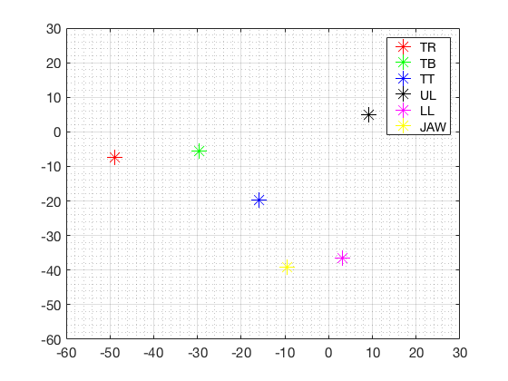
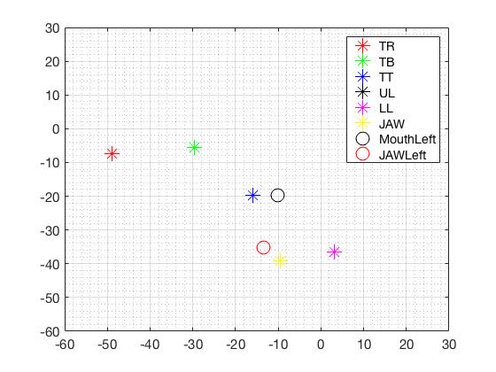

# Haskins Production Rate Comparison Database (HPRC)
last updated: 2025-01-10

## 1. Description
Database of speech production recorded at two speech rates (ie., "fast" vs. "normal")

## 2. Data types
1. Articulatory data (EMA; electromagnetic articolography)
2. Acoustic data (simultaneous recording)

## 3. Data specifications
### (1) Articulatory data
- EMA data
- Head movement is corrected and aligned to occlusal plane with origin at UI ref (upper incisor).
- Sensors (See <a href="#fig1">Fig 1</a>)
    - TR: tongue rear (dorsum)
    - TB:  tongue blade
    - TT: tongue tip (~ 1cm back from apex)
    - UL: upper lip (vermillion border)
    - LL: lower lip
    - ML: mouth left (corner)
    - JAW: jaw (lower medial incisors)
    - JAWL: jaw left (canine)

#### Figure 1

    
    

### (2) Acoustic data
acoustic data

## 4. Exploratory Data Analysis
### (1) Descriptive statistics

### (2) Individual articulatory and acoustic data distribution

## 5. References
- Tiede, M. (2017). Haskins IEEE Rate Comparison DB. https://yale.app.box.com/s/cfn8hj2puveo65fq54rp1ml2mk7moj3h

